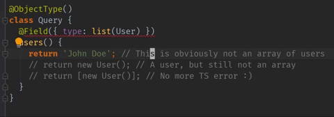

# revali

A TypeScript library for building GraphQL APIs efficiently with type safe decorators.



Project goals:

- As close to 100% type safety between GraphQL schema and code as possible;
  if it compiles, there shouldn't be runtime type errors
- Single source of truth for both schema types and TS types
- Lightweight wrapper around [graphql-js](https://github.com/graphql/graphql-js) -
  stay flexible and easy to comprehend

## Table of Contents

- [Installation](#installation)
- [Usage](#usage)
  - [Patterns](#patterns)
  - [Standard Scalars](#standard-scalars)
  - [Object Types](#object-types)
  - [Input Object Types](#input-object-types)
  - [Arguments](#arguments)
  - [Nullable and Lists](#nullable-and-lists)
  - [Enums](#enums)
  - [Union Types](#union-types)
  - [Root Types](#root-types)
  - [Schema](#schema)
  - [Context](#context)
  - [Resolver Fields](#resolver-fields)
  - [Custom Scalars](#custom-scalars)
- [Caveats](#caveats)
- [Why?](#why)
- [Credit](#credit)

## Installation

TBD

## Usage

> This guide assumes familiarity with [GraphQL](https://graphql.org/learn/).

### Patterns

The goal is to keep this simple and unopinionated. Most decorators/functions for creating types accept all the same
options as their counterparts in `graphql-js`, but with a differently typed `type` option. For specifics,
see the type definitions.

The only special patterns needed are:

- 1:1 mapping between GraphQL types and TS types
- For it to be typed, Context has to be a class (see [context](#context))

### Standard Scalars

TS GraphQL provides wrapped versions of all the built-in scalars:

```typescript
import {TSGraphQLBoolean, TSGraphQLFloat, TSGraphQLID, TSGraphQLInt, TSGraphQLString} from 'revali'
```

### Object Types

Object types use the decorators `ObjectType` and `Field`.

> For `Field`, `InputField`, and `Arg`, you can leave out the `type` option
> for properties explicitly typed as `string`, `number`, or `boolean`.
> For methods and other types it is required (this is enforced with TS types).
> It is best to explicitly set the type though - see [implicit type caveat](#implicit-types)

The `Field` decorator can be applied to a property or a method. The method takes
parameters `args`, `context` and `info`. `source` is left out as it is available as `this`.

```typescript
import {ObjectType, Field, TSGraphQLInt, TSGraphQLString} from 'revali'

@ObjectType()
class Vehicle {
  @Field({description: 'Make of the vehicle'})
  make: string

  @Field({description: 'Model of the vehicle'})
  model: string

  @Field({
    type: TSGraphQLInt,
    description: 'Year the vehicle was produced',
  })
  year: number

  @Field({type: TSGraphQLString})
  title() {
    return `${this.year} ${this.make} ${this.model}`
  }

  //...
}
```

### Input Object Types

Input objects have different decorators from output objects: `InputObjectType` and `InputField`.

```typescript
import {InputObjectType, InputField, TSGraphQLID} from 'revali'

@InputObjectType()
class ServiceRequestInput {
  @InputField({type: TSGraphQLID})
  vehicleID!: string | number

  // You can use property initializers to specify the default value
  @InputField()
  description: string = ''

  // Or the config option defaultValue
  @InputField({
    type: TSGraphQLInt,
    defaultValue: 55,
  })
  code!: number
}
```

### Arguments

There are two options for defining arguments to a resolver. If the resolver requires
only one argument then we can inline it directly on the function. It's required to
describe the name of the paremeter due to a limitation in the parameter decorator reflection.

```typescript
import {Arg, ObjectType, Field} from 'revali'

@ObjectType()
class Mutation {
  @Field({type: ServiceRequestPayload})
  requestService(@Arg('id') id: string, context) {
    // ...
  }
}
```

If you have more than one argument the Args decorator can be used. Args have the same
config options and behavior as input object types. Arg and input object type classes
will be instantiated.

```typescript
import {Args, InputField, ObjectType, Field} from 'revali'

@Args()
class ServiceRequestArgs {
  @InputField({type: ServiceRequestInput})
  input!: ServiceRequestInput

  @InputField()
  option!: string
}

// ...

// Usage

@ObjectType()
class Mutation {
  @Field({type: ServiceRequestPayload, args: ServiceRequestArgs})
  requestService(args, context) {
    // args instanceof ServiceRequestArgs === true
    const {input, option} = args
    // input instanceof ServiceRequestInput === true
    const {vehicleID} = input
    // ...
  }
}
```

### Nullable and Lists

Fields/args are non null by default as that matches how TypeScript works, unlike graphql-js where everything is nullable
by default. To make a field nullable, call `nullable` with the type, for lists, use `list`:

```typescript
import {
  nullable,
  list,
  //...
} from 'revali'

@Field({ type: nullable(TSGraphQLString) })
nullableString!: string | null

@Field({ type: list(TSGraphQLInt) })
integerList!: number[]

@Field({ type: nullable(list(nullable(Foo))) })
maybeListOfMaybeFoo: Array<Foo | null> | null
```

### Enums

You can use TS enums in your code, and create a type for TS GraphQL to use.

```typescript
import { enumType, EnumTypeCase, Field } from 'revali'

enum Shape {
  Square,
  Circle,
  Triangle,
}

// In schema will be: Square, Circle, Triangle
const ShapeType = enumType(Shape)
// Or if you want constant case in schema (SQUARE, CIRCLE, TRIANGLE)
const ShapeType = enumType(Shape, {
  changeCase: EnumTypeCase.Constant,
})

// In an object type...
@Field({ type: ShapeType })
shape() {
  return Shape.Circle
}
```

You can set `description` and `deprecationReason` for enum values with `additional`:

```typescript
const ShapeType = enumType(Shape, {
  additional: {
    Square: {description: '4 sides, all of equal length'},
  },
})
```

### Union Types

Union types are a little verbose, but there isn't really a way
around it:

```typescript
import {ObjectType, Field, unionType} from 'revali'

@ObjectType()
class A {
  @Field()
  a!: string
}

@ObjectType()
class B {
  @Field()
  b!: string
}

const AOrB = unionType<A | B>({
  name: 'AOrB',
  types: [A, B],
})
```

### Root Types

There aren't any special functions for the root types, they are
just object types.

However, if you create them as classes, type safety is a little off as you won't have
access to instances of those classes - resolver methods will be bound to whatever the
root value is.

TBD: describe in more detail that Root types will be bound to null

### Schema

The GraphQL schema can be generated using the `compileSchema` utility function. It
requires the root type Schema object and optionally a Mutation object.

```typescript
import {compileSchema} from 'revali'

const schema = compileSchema({Query, Mutation})
```

### Context

For context to be type checked, it must be an instance of a class.

```typescript
class Context {
  constructor(public viewerId: string) {}
}
```

For resolver methods, you can pass the context option:

```typescript
@ObjectType()
class Foo {
  @Field({
    type: TSGraphQLString,
    context: Context,
  })
  bar(args: {}, context: Context) {
    return 'foobar'
  }
}
```

However, you'll most likely want your context type to be the
same in every resolver. You can create a field decorator bound
to your context type and use that instead of `Field` from `revali`:

```typescript
// Field.ts
import Context from './Context'
import {fieldDecoratorForContext} from 'revali'

export default fieldDecoratorForContext(Context)

// Elsewhere
import Field from './Field'
// And use normally
```

### Resolver Fields

TBD: waterfall query solutions using `@Field({acceptsUnresolvedParent})` and `@BaseType`

### Custom Scalars

For your own scalars you can use `scalarType`:

```typescript
import {scalarType} from 'revali'

// ...

const Date = scalarType({
  name: 'Date',
  description: 'ISO-8601 string',
  serialize,
  parseValue,
  parseLiteral,
})
```

Or, you can wrap custom scalars, providing the TS type to associate:

```typescript
import {wrapScalar} from 'revali'
import SomeScalar from 'some-scalar'

const SomeScalarTyped = wrapScalar<SomeType>(SomeScalar)
```

## Caveats

There are a few things that can't be caught at compile time:

###### Nullable Input Fields

Nullable fields on input types don't enforce that the TS property is
nullable. This is because `T` is assignable to `T | null`, which works
fine for output types but not so much for input. There might be
a way to type this correctly but haven't figured it out yet.

###### Input/Output type checking

Input types used where an output type is expected and vice versa
won't show an error at compile time, they will immediately throw a runtime
error though.

###### Implicit Types

Leaving out the field type for properties implicitly typed as primitives
won't throw a compile time error, but will immediately throw at runtime. For example:

```typescript
@Field()
shape: 'circle' | 'square'

@Field()
color = 'red'
```

###### Matching object types

Because TS is "duck-typed", if you manage to have two classes used for object
types that have the exact same fields, returning the wrong class can't be
caught at build time. E.g:

```typescript
@ObjectType()
class A {
  @Field()
  foo!: string
}

@ObjectType()
class B {
  @Field()
  foo!: string
}

@ObjectType()
class C {
  @Field({type: A})
  a() {
    return new B()
  }
}
```

## Why?

This library is the result of experiencing many frustrations while working with
GraphQL and TypeScript, whether that was programmatically with graphql-js, or
writing schemas in the SDL and using something like graphql-cli to generate types from them.

The main issues:

- Either way, you have to write types twice. Even worse, since the SDL is either
  strings or text files, you can't use features of the language to DRY up common
  args and types.

- There is a disconnect between return values of resolvers and the field types
  of the schema. For example, the resolver can return null, but the schema has it marked
  as non null. This is a runtime error, and one that can't be caught immediately,
  so unless you have every single field tested with every possible condition,
  the error won't be thrown until some point later in the QA cycle,
  potentially even after deployment.

This library solves both of those:

- Every component of the schema has a single source of truth and support
  using `extends` to inherit fields/args.
- Type mismatch errors for all schema components are enforced by TS types
  and shown at compile time

## Credit

Forked from [ts-graphql](https://github.com/stephentuso/ts-graphql) by [stephentuso](https://github.com/stephentuso)

Other similar libraries:

- [type-graphql](https://github.com/19majkel94/type-graphql)
- [typegql](https://github.com/prismake/typegql)
